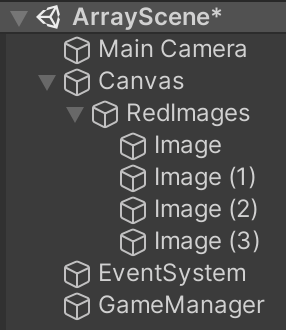
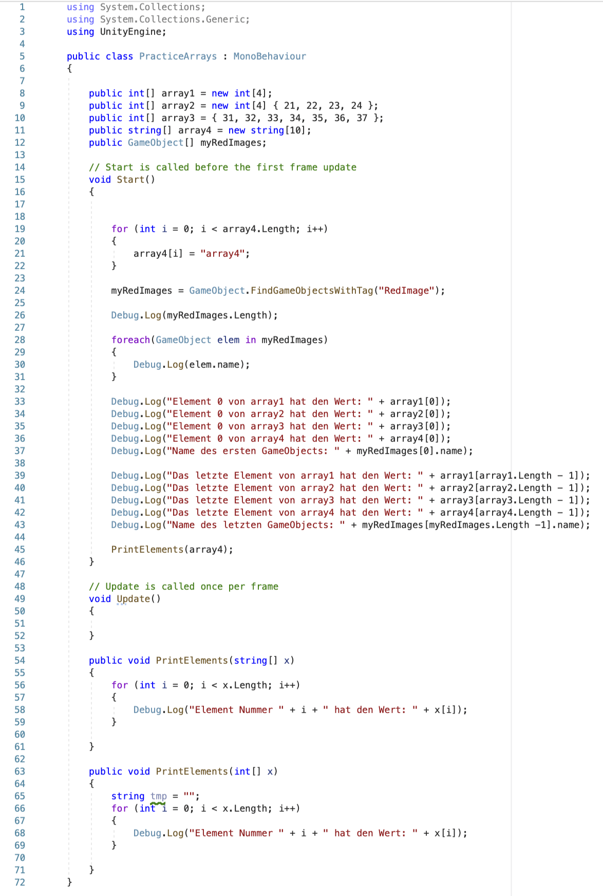

# rKremser-array

### Project description: 
Übung zu Arrays

### Development platform: 
MacOS, Unity 2020.1.5f1, Visual Studio 2019, no SDKs

### Target platform: 
WebGL, ref:res 960x600, screen-independent

### Visuals: 

### Necessary setup/execution steps: 
Add the Unity Project in Unity Hub and open it.

### Third party material: 
-

### Project state: 
50%

### Limitations: 
-

### Lessons Learned: 

Copyright by rKremser
